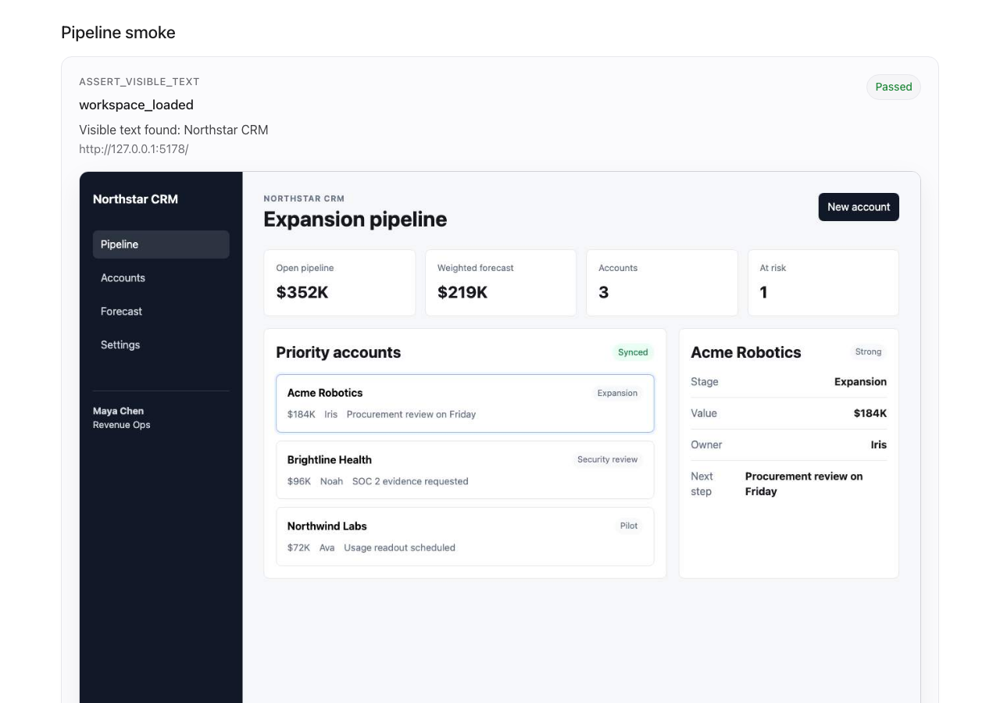

# Layout QA

[](https://www.npmjs.com/package/@trylayout/qa)
[](https://github.com/Layout-App/layout-qa/actions/workflows/ci.yml)
[](LICENSE)

Layout QA is a browser QA protocol and runner for frontend changes. It runs deterministic flows against a local or CI-served URL, can start manifest-declared QA services, captures screenshots at meaningful checkpoints, checks browser health, and writes a static HTML report.

The core loop is intentionally local:

```bash
npx @trylayout/qa init
npx @trylayout/qa check --start-app --skip-install --open
npx @trylayout/qa check smoke --target-url http://localhost:5173 --scenario happy_path --open
npx @trylayout/qa test "test checkout recovery" --repo owner/repo --ref feature-branch
```

Local scripted checks require no account, hosted service, or external docs.
Remote AI tests require a Layout organization API key and create persisted,
shareable Layout reports.

## Example Report



Package names:

- Canonical npm package: `@trylayout/qa`
- Convenience npm alias: `layout-qa`
- CLI binaries: `trylayout` and `layout-qa`

These commands are equivalent:

```bash
npx @trylayout/qa check --target-url http://localhost:5173 --scenario happy_path --open
npx layout-qa check --target-url http://localhost:5173 --scenario happy_path --open
```

## Why This Exists

Frontend agents and developers can move faster when they have a visual feedback loop they can run themselves. Layout gives the repo a small protocol:

- Declare any QA data/API service the app needs in `.layout/qa.json`.
- Point the frontend API base URL at `$services.api.url` or any other named service URL.
- Wire auth and unavoidable SDK behavior behind whatever QA env flag your app already understands.
- Switch response states with `localStorage["layout.qa.scenario"]`.
- Declare high-value browser flows in `.layout/qa.json`.
- Run the CLI locally or in GitHub Actions and inspect the generated screenshots/report.

The goal is not to replace Playwright. The goal is to make the browser QA loop simple enough for a team or coding agent to run before frontend changes merge.

## Install

Use it directly with `npx`:

```bash
npx @trylayout/qa check --target-url http://localhost:5173
```

The package is also available under the unscoped alias `layout-qa` for agents and tools that infer the package name from this repository:

```bash
npx layout-qa check --target-url http://localhost:5173
```

Or install it in a project:

```bash
npm install --save-dev @trylayout/qa
npx trylayout install-browsers
npx trylayout check --target-url http://localhost:5173
```

The package uses Playwright underneath. If your environment does not already
have Chromium installed for Playwright, run the Layout wrapper once:

```bash
npx @trylayout/qa install-browsers
```

## Quick Start

Create a starter flow manifest:

```bash
npx @trylayout/qa init
```

Start the built-in mock service in one terminal:

```bash
npx @trylayout/qa mock-api --scenario happy_path
```

Start your app with whatever QA flags your project uses and point its API base URL at the printed service URL:

```bash
VITE_API_BASE_URL=http://127.0.0.1:4311 \
npm run dev
```

Run a scenario:

```bash
npx @trylayout/qa check \
  --target-url http://localhost:5173 \
  --scenario happy_path \
  --open
```

If `.layout/qa.json` contains an `app` block, run the whole local scripted
session from one command:

```bash
npx @trylayout/qa check --start-app --skip-install --open
```

That starts every declared `services` entry, starts the app with the
manifest `app.start` command, runs manifest flows, writes the report, and shuts
the child processes down when finished or interrupted.

Each run writes:

```text
.layout/runs/<timestamp-scenario-viewport>/
  index.html
  result.json
  screenshots/
    01-<step>.jpg
    final.jpg
```

The process exits `0` on pass and `1` on failure, so the same command can run in CI.

## Commands

```text
trylayout init [options]
trylayout test "intent" --repo <owner/repo> --ref <branch> [options]
trylayout status <run_id> [options]
trylayout check [flow_id ...] [options]
trylayout install-browsers
trylayout mock-api [options]
trylayout run --target-url <url> [options]
trylayout remote run --repo <owner/repo> --ref <branch> [options]
trylayout remote status <run_id> [options]
layout-qa test "intent" --repo <owner/repo> --ref <branch> [options]
layout-qa status <run_id> [options]
layout-qa check [flow_id ...] [options]
layout-qa mock-api [options]
layout-qa run --target-url <url> [options]
npx @trylayout/qa test "intent" --repo <owner/repo> --ref <branch> [options]
npx @trylayout/qa status <run_id> [options]
npx @trylayout/qa check [flow_id ...] [options]
npx @trylayout/qa install-browsers
npx @trylayout/qa mock-api [options]
npx @trylayout/qa run --target-url <url> [options]
npx @trylayout/qa remote run --repo <owner/repo> --ref <branch> [options]
npx @trylayout/qa remote status <run_id> [options]
npx layout-qa test "intent" --repo <owner/repo> --ref <branch> [options]
npx layout-qa status <run_id> [options]
npx layout-qa check [flow_id ...] [options]
npx layout-qa mock-api [options]
npx layout-qa run --target-url <url> [options]
```

Options:

```text
--target-url <url>     URL of the running frontend to test.
--scenario <name>      Scenario to activate. Defaults to happy_path.
--flows <path>         Flow manifest path. Defaults to .layout/qa.json.
--mock-root <path>     Mock service root. Defaults from .layout/qa.json services.api.root.
--port <number>        Port for mock-api or a single service. Defaults to an available local port.
--out <path>           Artifact directory. Defaults to .layout/runs.
--viewport <value>     Viewport preset or size. Use desktop, tablet, mobile, or WIDTHxHEIGHT. Defaults to desktop.
--timeout <ms>         Browser run timeout. Defaults to LAYOUT_QA_TEST_TIMEOUT_MS or 60000.
--headed               Show the browser instead of running headless.
--open                 Open the generated local HTML report after the run.
--json                 Print machine-readable JSON.
--api-url <url>        Layout API base URL. Defaults to https://api.trylayout.com/v1/qa.
--api-key <key>        Layout organization API key for remote runs.
--repo <name>          Repository full name, e.g. owner/repo.
--branch <name>        Branch name for report metadata.
--ref <name>           Branch/ref for a remote run. Defaults to --branch.
--commit-sha <sha>     Commit SHA for remote run metadata.
--run-id <id>          Remote Layout run id for status checks.
--mode <value>         scripted or ai. Defaults to ai for remote run.
--intent <text>        Natural-language intent for AI testing remote runs.
--start-app            Start the app from .layout/qa.json before local checks.
--serve-mocks          Start manifest services before local checks. Automatic with --start-app.
--skip-install         With --start-app, skip app.install.
--force                Overwrite an existing flow file during init.
```

## Flow Manifest

Default path: `.layout/qa.json` in the current working directory. In monorepos,
run Layout QA from the package/app directory you want to test, or pass
`--flows <path>` explicitly for a different manifest.

```json
{
  "version": 1,
  "services": {
    "api": {
      "type": "mock",
      "root": ".layout/api",
      "scenario": "happy_path"
    }
  },
  "app": {
    "root": ".",
    "install": "npm ci",
    "start": "npm run dev -- --host 127.0.0.1 --port $PORT",
    "healthUrl": "http://127.0.0.1:$PORT/",
    "env": {
      "VITE_API_BASE_URL": "$services.api.url"
    }
  },
  "viewports": ["desktop"],
  "flows": [
    {
      "id": "workspace_smoke",
      "label": "Workspace smoke",
      "scenarios": ["happy_path"],
      "steps": [
        {"visit": "/"},
        {"screenshot": "Workspace loaded", "expect": {"text": ["Dashboard"]}},
        {"click": "[data-layout-qa='open-settings']"},
        {"screenshot": "Settings open", "expect": {"text": ["Settings"]}}
      ]
    }
  ]
}
```

Top-level fields:

- `version`: currently `1`.
- `services`: optional named QA services. Layout starts these before the app and exposes each URL as `$services.<name>.url`.
- `app`: optional for local CLI-only runs, required for Layout-managed branch runs. Defines how to install and start the frontend.
- `viewports`: optional default viewport labels for hosted/CI integrations.
- `flows`: array of flow definitions.

Service types:

- `mock`: Layout's built-in JSON scenario server.
- `command`: a user-provided server command such as MSW, a fake API, or a local backend in QA mode.
- `external`: an already-running URL.

Command services use the same lifecycle as the app:

```json
{
  "services": {
    "api": {
      "type": "command",
      "root": "api",
      "install": "npm ci",
      "start": "npm run qa -- --host 127.0.0.1 --port $PORT",
      "healthUrl": "http://127.0.0.1:$PORT/health",
      "env": {
        "QA_MODE": "true"
      }
    }
  },
  "app": {
    "env": {
      "VITE_API_BASE_URL": "$services.api.url"
    }
  }
}
```

Layout does not require a specific QA flag name. `app.env` and service `env`
are whatever the app/server understands.

## Mock API Scenarios

`layout-qa init` creates starter scenarios in:

```text
.layout/api/scenarios/
  happy_path.json
  empty.json
  error.json
```

Each scenario maps requests to deterministic responses:

```json
{
  "GET /api/me": {
    "status": 200,
    "body": {
      "id": "qa-user",
      "email": "qa@example.com"
    }
  },
  "GET /api/orders": {
    "status": 200,
    "body": []
  },
  "POST /api/payment": {
    "status": 402,
    "delayMs": 500,
    "body": {
      "message": "Payment failed"
    }
  }
}
```

Route keys are `METHOD /path`. Exact paths and simple `*` wildcards are supported, for example `GET /api/orders/*`. Missing fixtures return `404` with the scenario name and available route keys so unhandled API calls are obvious.

The app still needs a small API-boundary hook, usually an API base URL env var:

```ts
const apiBaseUrl = import.meta.env.VITE_API_BASE_URL || "";

export function apiFetch(path: string, options?: RequestInit) {
  return fetch(`${apiBaseUrl}${path}`, options);
}
```

Auth, third-party SDKs, browser storage, and destructive writes may still need QA-mode guards because they cannot always be solved by a mock API server.

## What to Commit

Commit the durable QA contract:

```text
.layout/qa.json
.layout/api/scenarios/*.json
.layout/.gitignore
```

Do not commit generated run artifacts:

```text
.layout/runs/
.layout/*runs/
**/.layout/runs/
**/.layout/*runs/
**/.layout/manual-qa-*/
```

The mock scenario files should contain fake deterministic data only. Do not put
secrets, production tokens, real customer data, or one-off local machine paths in
`.layout/api`.

`layout-qa init` writes `.layout/.gitignore` with generated report directories
ignored so reports stay local while the manifest and mock scenarios remain
reviewable in pull requests. Local report commands also update the nearest
`.layout/.gitignore` automatically when they write artifacts under a `.layout`
directory.

If a Layout-managed run drafts temporary flows from natural-language intent,
those draft edits happen only inside Layout's temporary checkout. Promote useful
drafted flows into `.layout/qa.json` manually when you want them to become
regression checks.

Flow fields:

- `id`: stable machine-readable flow id.
- `label`: human-readable report title.
- `scenarios`: scenario names this flow can run against. Use an empty array to allow all scenarios.
- `steps`: ordered browser steps.

Step fields:

- `id`: stable machine-readable step id.
- `type`: explicit step type for advanced steps.
- `label`: optional human-readable report label.
- `screenshot`: set `true` to capture a screenshot after the step.
- `expect`: optional assertions attached to a step.
- `timeoutMs`: optional per-step timeout.
- `tolerance`: optional pixel tolerance for layout assertions.
- `minWidth`, `maxWidth`, `minHeight`, `maxHeight`: optional `assert_box` constraints.

Supported shorthand steps:

- `{"visit": "/path"}`: navigate to a path.
- `{"click": "[data-layout-qa='action']"}`: click a selector. If the string does not look like a selector, it is treated as visible text.
- `{"screenshot": "Human label"}`: capture a screenshot checkpoint.

Supported explicit step types:

- `goto`: navigate to `url`.
- `click`: click by `selector` or visible `text`.
- `fill`: fill a `selector` with `value`.
- `reload`: reload the current page and wait for the DOM to be ready.
- `wait`: wait for `timeoutMs`; attached expectations are checked after the wait.
- `assert_visible_text`: require visible `text`.
- `wait_for_text`: alias for a visible text wait.
- `assert_not_visible_text`: require `text` not to be visible.
- `assert_absent_text`: alias for `assert_not_visible_text`.
- `assert_stable_for`: repeatedly apply attached expectations for `timeoutMs`.
- `assert_url`: require current URL to equal `url` or contain `contains`.
- `assert_no_horizontal_overflow`: require the page not to overflow the viewport horizontally.
- `assert_in_viewport`: require a `selector` or visible `text` to have a nonzero box intersecting the viewport.
- `assert_box`: require a `selector` or visible `text` to satisfy width/height constraints.
- `screenshot`: capture a screenshot checkpoint.

Supported expectations:

- `{"expect": {"text": ["Visible copy"]}}`: require visible text after the step.
- `{"expect": {"noText": ["Loading..."]}}`: require text not to be visible after the step.
- `{"expect": {"notText": ["Loading..."]}}`: alias for `noText`.
- `{"expect": {"noConsoleErrors": true}}`: require no console/page errors observed so far.

Examples:

```json
{ "visit": "/checkout" }
```

```json
{ "click": "[data-layout-qa='simulate-payment-timeout']" }
```

```json
{ "screenshot": "Payment timeout recovery", "expect": { "text": ["Payment failed", "Try again"] } }
```

```json
{ "id": "open_settings", "type": "click", "text": "Settings" }
```

```json
{ "id": "email", "type": "fill", "selector": "input[name='email']", "value": "layout@example.com" }
```

```json
{ "id": "settings_url", "type": "assert_url", "contains": "/settings" }
```

```json
{ "id": "reload_detail", "type": "reload", "timeoutMs": 10000 }
```

```json
{
  "id": "detail_stays_loaded",
  "type": "assert_stable_for",
  "timeoutMs": 3000,
  "expect": {
    "text": ["Order details"],
    "noText": ["Loading order", "Order unavailable"]
  }
}
```

```json
{ "id": "no_overflow", "type": "assert_no_horizontal_overflow" }
```

```json
{ "id": "main_visible", "type": "assert_in_viewport", "selector": "main" }
```

```json
{
  "id": "primary_cta_size",
  "type": "assert_box",
  "selector": "[data-qa='primary-cta']",
  "minWidth": 120,
  "maxHeight": 56
}
```

## Viewports

The runner defaults to the desktop viewport, `1280x900`. Use `--viewport` to run the same flow at a preset or exact size:

```bash
npx @trylayout/qa check --target-url http://localhost:5173 --viewport desktop
npx @trylayout/qa check --target-url http://localhost:5173 --viewport tablet
npx @trylayout/qa check --target-url http://localhost:5173 --viewport mobile
npx @trylayout/qa check --target-url http://localhost:5173 --viewport 390x844
```

Presets:

- `desktop`: `1280x900`
- `tablet`: `768x1024`
- `mobile`: `390x844`

The selected viewport is written to `result.json`, shown in the HTML report, and included in the run directory name.

## Local Reports And Remote Runs

The CLI is local-first for `check` and `run`: it writes HTML, JSON, and screenshots under `.layout/runs` and does not upload local run data to Layout.

Use `test` when you want a persisted, shareable Layout report. Remote runs are executed by Layout against a connected repo/ref so the stored report has reproducible environment metadata.

Environment fallbacks:

- `LAYOUT_API_URL`
- `LAYOUT_API_KEY`
- `LAYOUT_REPOSITORY`
- `LAYOUT_REF`
- `LAYOUT_BRANCH`
- `LAYOUT_COMMIT_SHA`
- `LAYOUT_INTENT`

In GitHub Actions, the CLI also reads `GITHUB_REPOSITORY`, `GITHUB_HEAD_REF`, `GITHUB_REF_NAME`, `GITHUB_SHA`, and `GITHUB_REF` when explicit flags are not provided.

## Remote AI Testing

The main hosted product asks Layout to run AI browser QA remotely against a
connected repo/ref:

```bash
npx @trylayout/qa test "test the checkout recovery flow" \
  --repo owner/repo \
  --ref feature-branch \
  --api-key "$LAYOUT_API_KEY"
```

Poll queued/running/completed remote tests with the same API key:

```bash
npx @trylayout/qa status <run_id> --api-key "$LAYOUT_API_KEY"
npx @trylayout/qa status <run_id> --api-key "$LAYOUT_API_KEY" --json
```

Remote AI tests require the repo to be connected through the Layout GitHub App
and to contain a valid `.layout/qa.json` launch contract.

## Scenarios

Before the app loads, the runner sets:

```js
localStorage.setItem("layout.qa.scenario", "<scenario>");
sessionStorage.setItem("layout.qa.runner", "1");
```

Your app can use `layout.qa.scenario` to switch deterministic API/auth response states:

- `happy_path`: normal populated data.
- `empty`: successful responses with empty states.
- `error`: failed or error responses that should render recovery UI.

The `layout.qa.runner` flag is useful for hiding local-only QA switchers from screenshots.

## Agent Setup Prompt

Paste this into your coding agent inside the frontend repo:

```text
Set up Layout QA for this web app.

Goal:
Create a browser QA loop that works locally and can also be used by Layout remote branch runs.

Rules:
- Use manifest `services` to declare how QA API/data responses are served.
- Do not require a hosted Layout service for local scripted checks.
- Keep built-in mock response fixtures in .layout/api/scenarios.
- Gate auth, SDKs, and unsafe writes behind whatever QA env flag this app already understands.
- Point the frontend API base URL at $services.api.url in .layout/qa.json app.env.
- Hide any local QA switcher or debug controls when sessionStorage["layout.qa.runner"] === "1".

Implementation:
- Add .layout/api/scenarios/happy_path.json, empty.json, and error.json with fake deterministic API responses, or add a services.api command that starts this repo's own QA backend.
- If the app has a central auth/session abstraction, add a deterministic QA user only when the Layout QA env flag is enabled.
- If auth is scattered or provider-SDK-only, leave a clear note in the PR/code comments and start with public or logged-out flows.
- Add .layout/qa.json with one smoke flow for the most important page.
- Prefer visible text and stable selectors.
- Add screenshot checkpoints after meaningful user-visible states.
- Commit .layout/qa.json, .layout/api/scenarios/*.json, and .layout/.gitignore.
- Do not commit .layout/runs, secrets, production tokens, or real customer data.

Run:
npx @trylayout/qa mock-api --scenario happy_path --port 4311
npx @trylayout/qa check --target-url <local app url> --scenario happy_path --open
npx @trylayout/qa check --target-url <local app url> --scenario empty --open
npx @trylayout/qa check --target-url <local app url> --scenario error --open
```

## CI Example

```yaml
name: Layout QA

on:
  pull_request:

jobs:
  qa:
    runs-on: ubuntu-latest
    steps:
      - uses: actions/checkout@v4
      - uses: actions/setup-node@v4
        with:
          node-version: 20
          cache: npm
      - run: npm ci
      - run: npx @trylayout/qa install-browsers
      - run: npx @trylayout/qa check --start-app --scenario happy_path
      - uses: actions/upload-artifact@v4
        if: always()
        with:
          name: layout-qa-report
          path: .layout/runs
```

## Current Scope

This package is intentionally small:

- It does run Playwright against an already-running frontend.
- It does write local screenshots and an HTML report.
- It does support deterministic scenario switching.
- It does support explicit viewport sizing.
- It does support lightweight layout assertions.
- It does support manifest-driven local app startup with `check --start-app`.
- It does support remote AI test requests when given a Layout API key.
- It does not perform AI review locally by itself.

The hosted Layout service owns remote AI browser testing and shared run reports;
the package stays the local/CI runner and remote-test trigger.

## Feedback

Issues and examples are welcome in [GitHub Issues](https://github.com/Layout-App/layout-qa/issues). You can also reach me on X at [@tscepo](https://x.com/tscepo).
